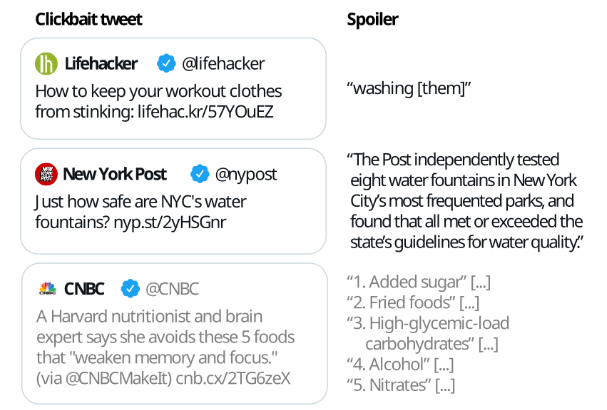

<!-- ABOUT THE PROJECT -->
## Clickbait Spoiling: A Combination of Question Answering and Summarization

Clickbait has been an issue to internet users for years. It arouses curiosity in readers to click on a link by providing only partial information on interesting topics and only provides low information in the articles. This creates profit for certain websites but wastes readers’ time, therefore, to tackle this issue the Clickbait Challenge was created as SemEval 2023 and further been used as the University of Waterloo MSCI 641 Text Analysis term project hosted on Kaggle ([task1][kaggle-task1], [task2][kaggle-task1]). The following is the example of the spoiling to the clickbait:

We adopted the classification, question-answering, and summarization natural language processing models and assemble them into a pipeline (see the image below) to tackle this challenge and discovered it outperforms the question-answering model alone for clickbait spoiling. In this work we mainly explore DeBERTa for classification, RoBERTa-based for question-answering and t5-base for summarization.

<!--
[![notebook screenshot][product-screenshot]](https://example.com)
-->
Please find more details in our [paper](clickbait_spoiling.pdf).

### Built With

We use the pretrained transformer models, such as DeBERTa, RoBERTa and t5, from [Hugging Face][huggingface-model]. These model are trained on [Kaggle Notebooks][kaggle-notebooks]	as it generously provides decent GPU resources, user-friendly interface for free.

[contributors-shield]: https://img.shields.io/github/contributors/othneildrew/Best-README-Template.svg?style=for-the-badge
[contributors-url]: https://github.com/othneildrew/Best-README-Template/graphs/contributors
[forks-shield]: https://img.shields.io/github/forks/othneildrew/Best-README-Template.svg?style=for-the-badge
[forks-url]: https://github.com/othneildrew/Best-README-Template/network/members
[stars-shield]: https://img.shields.io/github/stars/othneildrew/Best-README-Template.svg?style=for-the-badge
[stars-url]: https://github.com/othneildrew/Best-README-Template/stargazers
[issues-shield]: https://img.shields.io/github/issues/othneildrew/Best-README-Template.svg?style=for-the-badge
[issues-url]: https://github.com/othneildrew/Best-README-Template/issues
[license-shield]: https://img.shields.io/github/license/othneildrew/Best-README-Template.svg?style=for-the-badge
[license-url]: https://github.com/othneildrew/Best-README-Template/blob/master/LICENSE.txt
[linkedin-shield]: https://img.shields.io/badge/-LinkedIn-black.svg?style=for-the-badge&logo=linkedin&colorB=555
[linkedin-url]: https://linkedin.com/in/othneildrew
[product-screenshot]: images/screenshot.png
[Next.js]: https://img.shields.io/badge/next.js-000000?style=for-the-badge&logo=nextdotjs&logoColor=white
[Next-url]: https://nextjs.org/
[React.js]: https://img.shields.io/badge/React-20232A?style=for-the-badge&logo=react&logoColor=61DAFB
[React-url]: https://reactjs.org/
[Vue.js]: https://img.shields.io/badge/Vue.js-35495E?style=for-the-badge&logo=vuedotjs&logoColor=4FC08D
[Vue-url]: https://vuejs.org/
[Angular.io]: https://img.shields.io/badge/Angular-DD0031?style=for-the-badge&logo=angular&logoColor=white
[Angular-url]: https://angular.io/
[Svelte.dev]: https://img.shields.io/badge/Svelte-4A4A55?style=for-the-badge&logo=svelte&logoColor=FF3E00
[Svelte-url]: https://svelte.dev/
[Laravel.com]: https://img.shields.io/badge/Laravel-FF2D20?style=for-the-badge&logo=laravel&logoColor=white
[Laravel-url]: https://laravel.com
[Bootstrap.com]: https://img.shields.io/badge/Bootstrap-563D7C?style=for-the-badge&logo=bootstrap&logoColor=white
[Bootstrap-url]: https://getbootstrap.com
[JQuery.com]: https://img.shields.io/badge/jQuery-0769AD?style=for-the-badge&logo=jquery&logoColor=white
[JQuery-url]: https://jquery.com
[huggingface-model]: https://huggingface.co/models
[kaggle-task1]: https://www.kaggle.com/competitions/clickbait-detection-msci641-s23
[kaggle-task2]: https://www.kaggle.com/competitions/task-2-clickbait-detection-msci641-s23-spoiler-gen/overview
[kaggle-notebooks]: https://www.kaggle.com/docs/notebooks